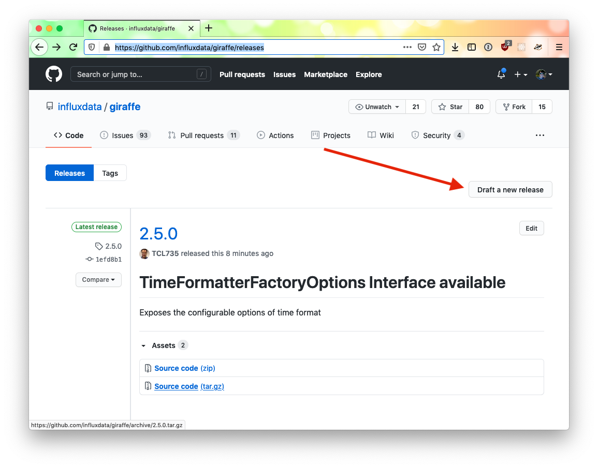
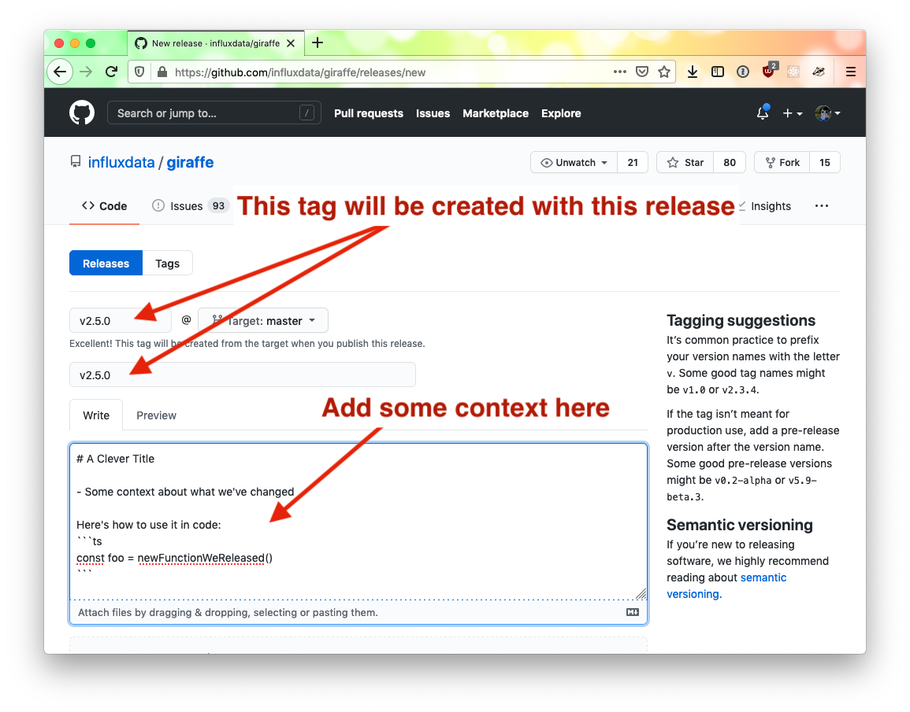

# Publishing a Release

Publishing Giraffe is a two step process. The first step involves using the command line to build and publish the library to npm; the second step involves drafting a release on Github.

Publishing on the command line is handled by the `publish` script in `giraffe/giraffe`. It takes a single argument: the version being published.

## Building the Release

```sh
./publish 2.5.0
```

This script will build Giraffe, publish the changes to npm, then update the `package.json` version number if the version passed in as an argument to the script doesn't match what's in `package.json/`

### Building Requirements:

1. Make sure you're in the `giraffe/giraffe` directory
1. Make sure you're on the `master` branch and you have the latest changes
1. Make sure you're logged in to npm (and you have sufficient permissions to publish) `(yarn|npm) login`
1. Make sure you give it a version number
    1. If `package.json`'s version doesn't match the version number passed in, it will attempt to update the version number in `package.json`

### Building Tips

If you're reading this before committing, bump the package version before running publish. That way, when publishing a release on Github, the commit points to the entire commit, and not the bumped package version. To see this in action, click the following releases then click the git commit hash on the left hand side. [Good.](https://github.com/influxdata/giraffe/releases/tag/2.4.0) [Not as good.](https://github.com/influxdata/giraffe/releases/tag/2.4.0)

## Drafting a Github Release

While the script is running, head over to https://github.com/influxdata/giraffe/releases. Click `Draft a New Release`.



The next page will let you draft a release. Enter the tag number - it should correspond to the version you published in the script, but have a `v` in front of it. So if you ran `./publish 2.5.0`, the tag would be `v2.5.0`. The release title should match the tag, including the `v` (`v2.5.0`). In the description, enter the kind of explanation you'd like to see if you were looking over a release of a library you're using and trying to decide if you should upgrade or not.


